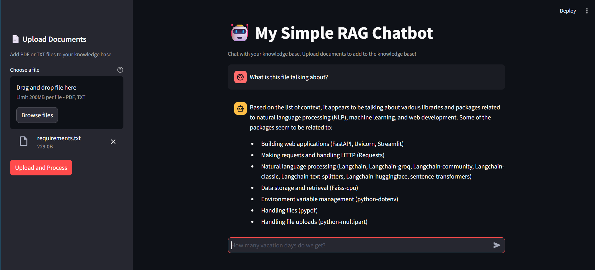

# RAG Chatbot Application

A Retrieval-Augmented Generation (RAG) chatbot application that allows you to upload documents (PDF or TXT) and ask questions about them. The application uses AI to provide intelligent answers based on your uploaded knowledge base.

## 📋 Description

This project implements a RAG (Retrieval-Augmented Generation) system that combines document retrieval with large language model generation. Users can:

- **Upload Documents**: Add PDF or TXT files to build a knowledge base
- **Chat with Documents**: Ask questions and get AI-powered answers based on the uploaded documents
- **Incremental Learning**: Add new documents to expand the knowledge base without resetting existing data

The application consists of:
- **Backend API**: FastAPI-based REST API that handles document processing and question answering
- **Frontend Interface**: Streamlit web application for interactive document upload and chatting

## 🛠️ Technologies Used

- **FastAPI**: Modern, fast web framework for building the backend API
- **Streamlit**: Interactive web application framework for the frontend
- **LangChain**: Framework for building applications with LLMs
- **Groq API**: Fast inference API for running the Llama 3.1 8B Instant model
- **FAISS**: Facebook AI Similarity Search library for vector similarity search
- **HuggingFace Transformers**: For generating embeddings using the `BAAI/bge-small-en-v1.5` model
- **PyPDF**: PDF document processing and text extraction
- **Uvicorn**: ASGI server for running the FastAPI application
- **Python-dotenv**: Environment variable management

## 🚀 Features

- 📄 Document upload (PDF and TXT formats)
- 🔍 Semantic search using vector embeddings
- 💬 Interactive chat interface
- 🧠 AI-powered question answering
- 📚 Persistent vector store for document storage
- 🔄 Incremental document addition

## 📸 Screenshots

### Application Interface



*The application interface showing document upload panel and chat functionality. Users can upload PDF or TXT files and ask questions about the uploaded documents.*

## 📦 Prerequisites

- Python 3.8 or higher
- Groq API key ([Get one here](https://console.groq.com/))
- pip (Python package manager)

## 🔧 Installation

1. **Clone the repository**
   ```bash
   git clone <your-repo-url>
   cd rag_project
   ```

2. **Create a virtual environment** (recommended)
   ```bash
   python -m venv venv
   ```

3. **Activate the virtual environment**
   
   On Windows:
   ```bash
   venv\Scripts\activate
   ```
   
   On macOS/Linux:
   ```bash
   source venv/bin/activate
   ```

4. **Install dependencies**
   ```bash
   pip install -r requirements.txt
   ```

## ⚙️ Configuration

1. **Create a `.env` file** in the project root directory:
   ```env
   GROQ_API_KEY=your_groq_api_key_here
   ```

2. Replace `your_groq_api_key_here` with your actual Groq API key.

## 🏃 Running the Application

### Step 1: Start the Backend API

In one terminal window, start the FastAPI backend:

```bash
python backend_api.py
```

The API will be available at `http://127.0.0.1:8000`

**Note**: The backend will automatically create an empty vectorstore if one doesn't exist. You can start using the application immediately - just upload documents through the frontend!

### Step 2: Start the Frontend Application

In another terminal window, start the Streamlit frontend:

```bash
streamlit run frontend_app.py
```

The application will automatically open in your browser at `http://localhost:8501`

### Optional: Initialize Vector Store with Existing Documents

If you want to pre-populate the knowledge base with existing documents before starting the application, you can use:

```bash
python prepare_vectorstore.py path/to/your/document.pdf
```

Or run it without arguments and it will prompt you for the file path:
```bash
python prepare_vectorstore.py
```

**Note**: This script will create or overwrite the vector store from scratch. For incremental document addition, use the upload feature in the frontend instead.

## 📖 Usage

1. **Upload Documents**: 
   - Use the sidebar in the Streamlit interface
   - Click "Choose a file" and select a PDF or TXT file
   - Click "Upload and Process" to add it to the knowledge base

2. **Ask Questions**:
   - Type your question in the chat input at the bottom of the page
   - The AI will search through your uploaded documents and provide an answer
   - Chat history is maintained during your session

3. **View Responses**:
   - Answers are displayed in the chat interface
   - The system retrieves relevant context from your documents before generating answers

## 📁 Project Structure

```
rag_project/
├── backend_api.py          # FastAPI backend server
├── frontend_app.py          # Streamlit frontend application
├── prepare_vectorstore.py  # Script to initialize vector store
├── requirements.txt        # Python dependencies
├── .env                   # Environment variables (create this)
├── faiss_index/           # Vector store directory (created automatically)
└── README.md             # This file
```

## 🔒 Important Notes

- Make sure the backend API is running before starting the frontend
- The `.env` file should be added to `.gitignore` to keep your API keys secure
- The vector store (`faiss_index` directory) will be created automatically when you first upload a document or run `prepare_vectorstore.py`
